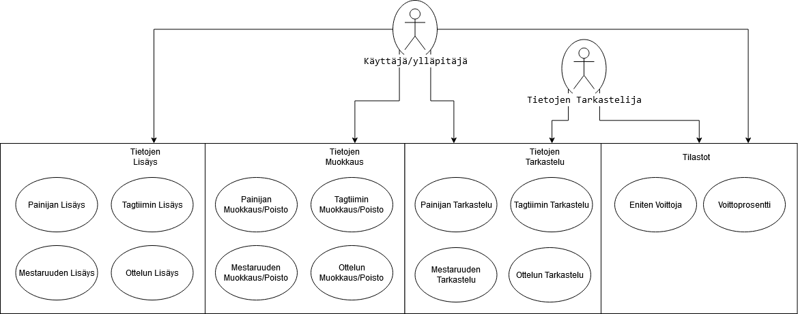
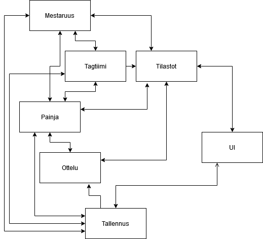
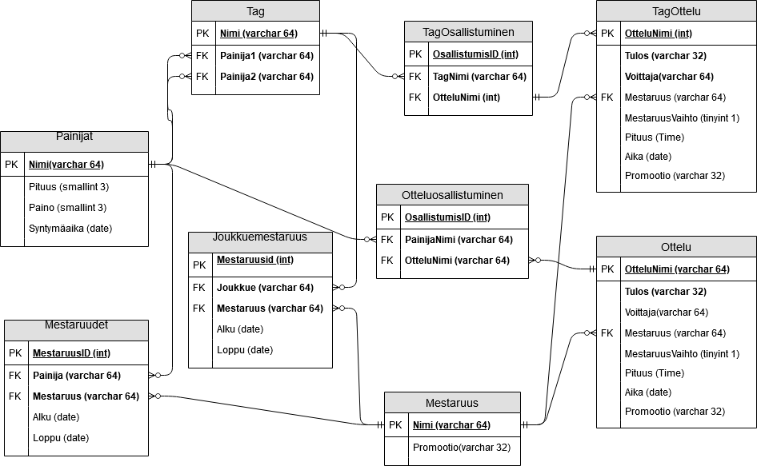

# AEWtracker Harjoitustyö-suunnitelma 

## Sisällysluoettelo
1. [Sisällysluoettelo](#sisällysluoettelo)
1. [Tekijä](#tekijä)
1. [Kuvaus](#kuvaus)
1. [Kohdeyleisö](#kohdeyleisö)
1. [Käyttöympäristö ja käytetyt teknologiat](#käyttöympäristö-ja-käytetyt-teknologiat)
1. [Toiminnot](#toiminnot)
    1. [Tietojan Tallennus](#tietojan-tallennus)
    1. [Tietojan Tarkastelu](#tietojan-tarkastelu)
    1. [Tietojan Muokkaus](#tietojan-muokkaus)
    1. [Ranking](#ranking)
1. [Käyttäjäroolit](#käyttäjäroolit)
    1. [Käyttäjä/ylläpitäjä](#käyttäjä/ylläpitäjä)
    1. [Tietojen Tarkastelija](#tietojen-tarkastelija)
1. [Käyttötapaus-kaavio](#käyttötapaus-kaavio)
1. [Käsitteet](#käsitteet)
1. [Työaikasuunnitelma](#työaikasuunnitelma)

## Tekijä
Yksin tekijänä Vili-Pekka Peltonen L4181 

## Kuvaus
Sovellus jolla voi ottaa ylös ja tarkastella showpainiotteluiden tuloksia. Testidatana käytetään AEW painipromootion tuloksia. Tämä koska promootio on suhteellisen uusi joten tarvittava datan määrä ei ole kovin suuri.

## Kohdeyleisö
Suunnattu ihmisille jotka seuraavat showpainia ja tykkäävät turhista tilastoista.

## Käyttöympäristö ja käytetyt teknologiat
Tehdään pääasiassa windows alustaiselle PC:lle. Totetetaan WPF sovelluksena käyttäen C# ja XAML kieliä. Tietokanta toteutetaan käyttämällä SQLiteä.

## Toiminnot

### Tietojan Tallennus
Sovelluksen kautta voidaan tietokanataan syöttää erilaisia tietoja. 

Päätietokatergoriat ovat:
- Painijat
    - Nimi
- Tagtiimit
    - Nimi
    - Jäsenet
- Mestaruudet
    - Mestarit
        - Mestaruusajat
- Ottelut
    - Osallistujat
    - Lopputulos
        - Voittaja
        - Voiton tapa
    - Ottelupäivä

### Tietojen Tarkastelu
Voidaan tarkastella painijan tai tagtiimin voittojen määriä, voitto/tappio suhteita ja mestaruuksia. Kahta joukuetta tai painijaa voidaan myös vertailla rinnakkain.

### Tietojen Muokkaus
Tietoja voi muokata ja poistaa jos ne on syötetty virheellisesti.

### Tilastot
Voidaan järjestellä joukkueita ja painijoita esimerkiksi voittojen määrien perusteella

## Käyttäjäroolit

### Käyttäjä/ylläpitäjä
Käyttäjä joka haluaa lisätä ja luoda uusia tietoja sovellukseen. Tarkastelee myös luotuija tietoja

### Tietojen Tarkastelija
Käyttää ainoastaan valmiiksi luotuja tietokantoja katsellakseen tilastoja

## Käyttötapaus-kaavio

## Käsitteet
- Painija
- Tagtiimi
- Mestaruus
- Ottelu

Käyttöliittymän kauttaa pääsee joko tallentamaan tietoja tai tarkastelemaan niitä tilastojen kautta.

### Tietokanta

## Työaikasuunnitelma
Mittaan työaikani käyttäen Toggl palvelua

| Ominaisuus          | Suuniteltu Valmistuminen | Valmis     | Käytety Aika |
|:-:|:-:|:-:|:-:|
| Suunnitelma         | 09.04.2020               | 09.04.2020 | 4h           |
| Tietojan Tallennus  | 13.04.2020               |            |              |
| Tietojan Tarkastelu | 16.04.2020               |            |              |
| Tietojan Muokkaus   | 20.04.2020               |            |              |
| Tilastot            | 25.04.2020               |            |              |